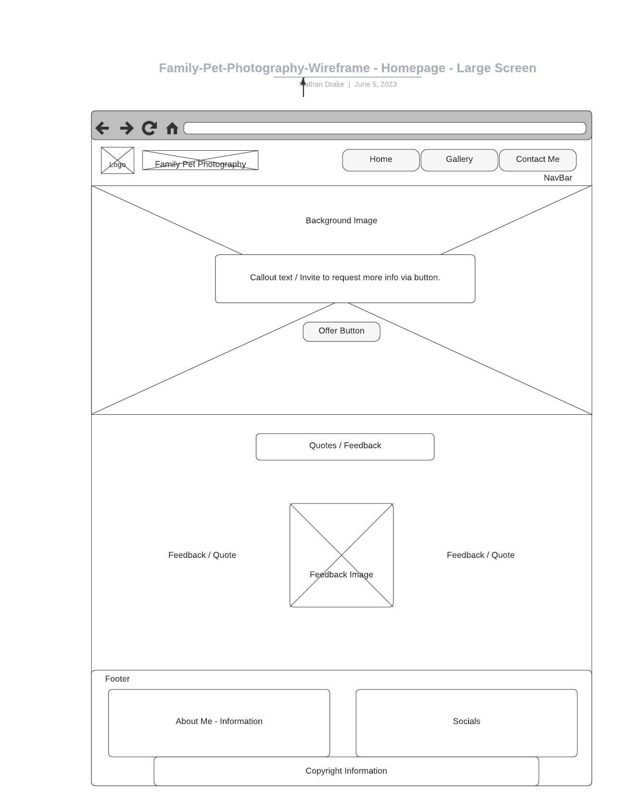
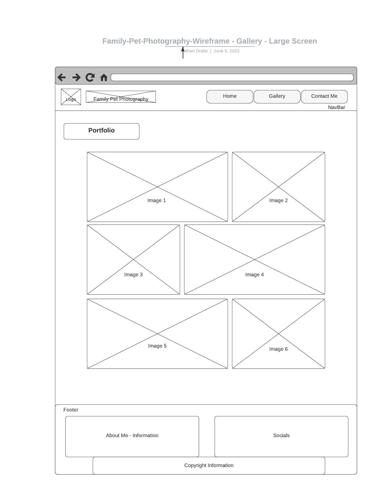
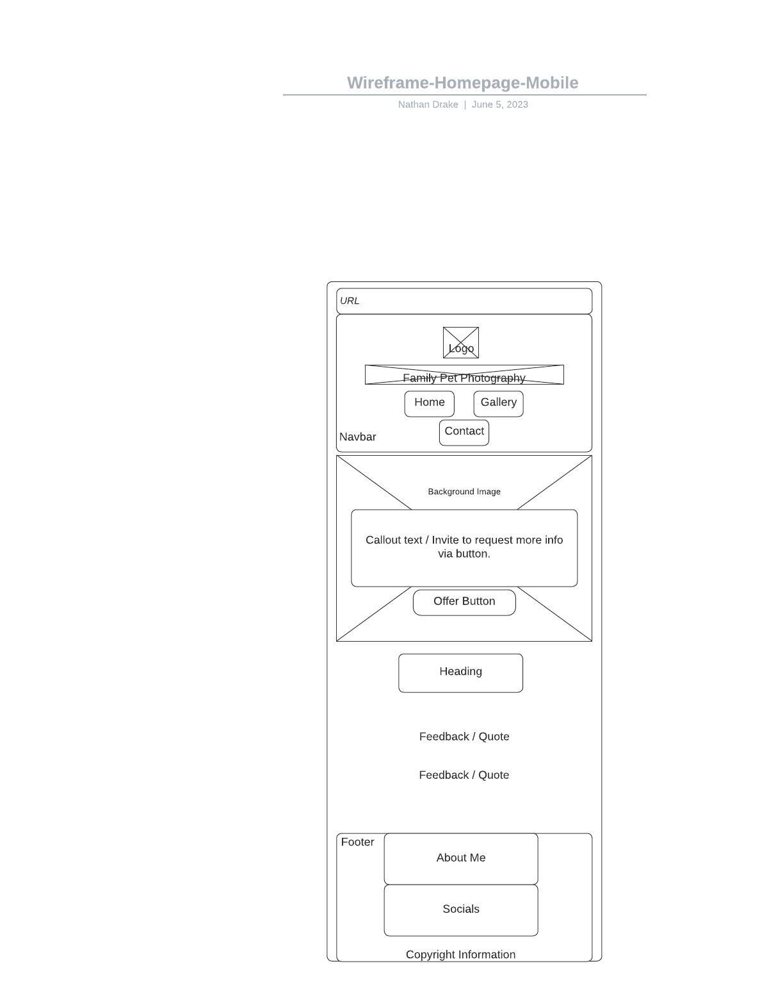

# Family Pet Photography

[https://orgnatedrake.github.io/milestone-project-1/] (www.orgnatedrake.github.io/milestone-project-1)

This is the README file for a three-page website, for a family pet photography business. The website consists of three main pages: Home, Gallery, and Contact Me.

## Table of Contents

- [Introduction](#introduction)
  - [Programming Languages](#programming-languages)
- [Features](#features)
- [Getting Started](#getting-started)
  - [Prerequisites](#prerequisites)
  - [Installation](#installation)
  - [Usage](#usage)
  - [Deployment](#deployment)
- [Folder Structure](#folder-structure)
- [User Experience UX](#user-experience-ux)
  - [User Stories](#user-stories)
    - [Current Pet Owners](#current-pet-owners)
    - [New Pet Owners](#new-pet-owners)
  - [Design Choices](#design-choices)
  - [HEX Colors and Fonts](#hex-colors-and-fonts)
- [Wireframes](#wireframes)
  - [Large Screen Homepage](#large-screen-homepage)
  - [Large Screen Gallery](#large-screen-gallery)
  - [Large Screen Contact Me](#large-screen-contact-me)
  - [Mobile Homepage](#mobile-homepage)
  - [Mobile Gallery](#mobile-gallery)
  - [Mobile Contact Me](#mobile-contact-me)
  - [Modal](#modal)
- [Testing](#testing)
  - [W3C](#w3c)
  - [JSLint](#jslint)
  - [Accessibility](#accessibility)
  - [User Stories Tested](#user-stories-tested)
    - [Current Pet Owners](#current-pet-owners)
    - [New Pet Owners](#new-pet-owners)
- [Bugs](#bugs)
- [Attribution](#attribution)
- [Contributing and Maintenance](#contributing-and-maintenance)

## Introduction

Family Pet Photography is a website dedicated to capturing precious moments of families and their beloved pets. A professional photographer specialises in creating beautiful and memorable images that reflect the unique bond between humans and their furry friends. With their expertise and passion for animals, they aim to provide stunning photographs that families will cherish for a lifetime.

## Programming Languages

1. **HTML5**
2. **CSS3**
3. **JS** `Within **Bootstrap v5.3** framework`

## Features

- Home: A welcoming introduction to the website, providing a callout offer and feedback from past client’s.
- Gallery: A collection of stunning pet photographs to showcase the photographer's skills and offer inspiration to potential clients.
- Contact Me: A contact form modal.
- Fully responsive across *Mobile*, *Tablet* and *Desktop* devices.

## Getting Started

To get a copy of this project up and running on your local machine, follow these steps.

### Prerequisites

- Web browser (Chrome, Firefox, Safari, etc.)
- Text editor or IDE (Visual Studio Code, Sublime Text, Atom, etc.)

### Installation

1. Clone the repository:

git clone [https://github.com/OrgNateDrake/milestone-project-1.git]

2. Open the project in your preferred text editor or IDE.

### Usage

1. Open the [index.html] file in your web browser to view the home page.
2. Navigate to the [gallery.html] file to explore the pet photography gallery.
3. For inquiries or to contact the photographer, visit the [contact.html] page.

### Deployment

You can view the live site through **GitHub Pages**, using the following link; [https://orgnatedrake.github.io/milestone-project-1/].
## Folder Structure

The folder structure for this project is as follows:

assets
 ┣ css
 ┃ ┗ style.css
 ┗ images
 ┃ ┣ Feedback-image.jpg
 ┃ ┣ contact-us-img.jpg
 ┃ ┣ family-and-pets.jpg
 ┃ ┣ favicon.jpg
 ┃ ┣ image1.jpg
 ┃ ┣ image2.jpg
 ┃ ┣ image3.jpg
 ┃ ┣ image4.jpg
 ┃ ┣ image5.jpg
 ┃ ┣ image6.jpg
 ┃ ┗ logo.jpg
docs
 ┗ PageSpeed-insight.png
Wireframes
 ┣ Wireframe-Contact-Large.jpeg
 ┣ Wireframe-Contact-Mobile.jpeg
 ┣ Wireframe-Gallery-Large.jpeg
 ┣ Wireframe-Gallery-Mobile.jpeg
 ┣ Wireframe-Home-Large.jpeg
 ┣ Wireframe-Homepage-Mobile.jpeg
 ┗ Wireframe-Modal.jpeg

## User Experience UX

### User Stories

#### Current Pet Owners

1. As a current pet owner, I want to find a pet photographer who specialises in capturing beautiful moments with pets, so I can have professional photos of my furry friend.
2. As a current pet owner, I want to explore a gallery of pet photographs to get inspired for my own pet's photo session and see the photographer's style and skills.
3. As a current pet owner, I want to easily navigate through the website and find information about the different packages and pricing options for pet photography sessions.
4. As a current pet owner, I want to learn about the photographer's experience and see testimonials from other pet owners who have used their services.
5. As a current pet owner, I want a simple and convenient way to contact the photographer to discuss my pet's photo session, book an appointment, or ask any questions I may have.

#### New Pet Owners

1. As a new pet owner, I want to discover a reliable and professional pet photographer who can capture precious moments with my new furry companion.
2. As a new pet owner, I want to browse through a gallery of pet photographs to get ideas and envision how my new pet's photo session could look like.
3. As a new pet owner, I want to easily find information about new/latest offers, explore options for pet photography sessions, so I can choose one that best suits my needs and budget.
4. As a new pet owner, I want to learn about the photographer's background and expertise, as well as read reviews or testimonials from other satisfied clients.
5. As a new pet owner, I want a user-friendly contact form or contact details readily available, so I can inquire about the services, ask questions, and schedule a photo session for my new pet.

These user stories capture the expectations and desires of both current pet owners and new pet owners, emphasising the importance of showcasing the photographer's work, providing clear information about promotions, and offering a seamless and convenient way to contact the photographer.

### Design Choices

1. **Warm and Playful Color Palette:** Choose a warm and inviting color palette that reflects the joyful and loving nature of family pet photography. Consider incorporating soft and comforting colors like shades of blue, green, and pastel hues to create a warm and friendly atmosphere.

2. **Whimsical and Playful Typography:** Select a typography style that is playful and friendly to resonate with family pet owners. Consider using rounded and friendly fonts that evoke a sense of warmth and approachability. The typography should be legible and easy to read across different devices and screen sizes.

3. **High-Quality Pet Photographs:** Showcase high-quality pet photographs throughout the website to demonstrate the photographer's skills and capture the attention of family pet owners. Use vibrant, sharp, and engaging images that portray the bond between pets and their families. Display a variety of pet breeds and interactions to appeal to a wide range of pet owners.

4. **Responsive and Intuitive Layout:** Create a responsive web design that adapts seamlessly to different devices, including desktops, tablets, and mobile phones. Ensure that the layout is intuitive and user-friendly, making it easy for visitors to navigate through the website and find the desired information without any confusion.

5. **Emphasis on Emotional Connection:** Highlight the emotional connection between families and their pets in the design elements. Incorporate heartwarming visuals, such as images of families playing with their pets or cuddling them, to evoke a sense of love and affection. Use subtle design elements, such as paw prints or pet-related icons, to reinforce the pet-centric theme.

6. **Clear and Accessible Information:** Present clear and concise information about the services offered, pricing packages, and any special offers or promotions. Make it easy for family pet owners to understand what they can expect from a pet photography session and how to proceed with booking or contacting the photographer.

7. **Feedback and Quotes:** Incorporate feedback and/or quotes from satisfied family pet owners who have used the photographer's services. Displaying positive feedback and experiences will build trust and confidence in potential clients, making them more likely to choose the photographer for their own pet photography needs.

8. **Call-to-Action Buttons:** Use strategically placed call-to-action buttons throughout the website to guide family pet owners towards important actions, such as contacting the photographer and new or reoccurring offers. Make these buttons visually distinct and inviting, encouraging visitors to take the desired actions.

### Hex Colors and Fonts

**Main:** #22afb0 *Light Marine Blue*
**Secondary:** #36d7d8 *Dark Marine Blue*

**Font:** *Montserrat*

## Wireframes

### Large Screen Homepage

### Large Screen Gallery

### Large Screen Contact Me

### Mobile Homepage

### Mobile Gallery

### Mobile Contact Me

### Modal

## Testing

### W3C

I have fully tested all three **HTML** pages and the one **CSS** stylesheet within W3C's validators. No fails found and all warnings were fully resolved and have now **passed all checks**.

### JSLint

I have fully tested all three **HTML** pages and the one **CSS** stylesheet within JSLint's validators. **passed all checks**.

### Accessibility and Performance

[https://pagespeed.web.dev]

### User Stories Tested

#### Current Pet Owners

1. I want to find a pet photographer who specialises in capturing beautiful moments with pets, so I can have professional photos of my furry friend.

  *Response:* I'm thrilled to have found a pet photographer who truly understands the beauty of capturing moments with our beloved pets. The portfolio showcases stunning photographs that reflect their expertise and passion.

2. I want to explore a gallery of pet photographs to get inspired for my own pet's photo session and see the photographer's style and skills.

  *Response:* Wow! The gallery is filled with enchanting pet photographs. Each image captures the unique personality of the pets and showcases the photographer's talent and artistic vision. I'm truly inspired for my own pet's session!

3. I want to easily navigate through the website and find information about the different packages and pricing options for pet photography sessions.

  *Response:* Navigating the website was a breeze, and I quickly found a link to contact the photographer. I sent all my questions and received a prompt response with all the information I needed.

4. I want to learn about the photographer's experience and see testimonials from other pet owners who have used their services.

  *Response:* It's reassuring to read about the photographer's extensive experience and dedication to capturing precious moments with pets. The testimonials from other pet owners are heartwarming and validate their skills. I feel confident in their abilities.

5. I want a simple and convenient way to contact the photographer to discuss my pet's photo session, book an appointment, or ask any questions I may have.

  *Response:* The contact information is readily available, and there's a user-friendly contact form. I appreciate the ease of reaching out to the photographer. It's comforting to know I can discuss my pet's session and have any questions answered promptly.

**These responses reflect the positive impressions of the current pet owners who have visited the website. They express enthusiasm for the photographer's expertise, the inspiration drawn from the gallery, the ease of finding information and contacting the photographer, and the reassurance gained from testimonials and the photographer's experience.**

#### New Pet Owners

1. I want to discover a reliable and professional pet photographer who can capture precious moments with my new furry companion.

  *Response:* I'm thrilled to have stumbled upon a reliable and professional pet photographer who understands the significance of capturing precious moments with new furry companions. Their dedication to pet photography is evident, and I'm excited to work with them.

2. I want to browse through a gallery of pet photographs to get ideas and envision how my new pet's photo session could look like.

  *Response:* The gallery is an absolute delight! It's filled with charming and heartwarming pet photographs that have sparked my imagination. I can't wait to plan my new pet's photo session and create lasting memories.

3. I want to easily find information about new/latest offers, explore options for pet photography sessions, so I can choose one that best suits my needs and budget.

  *Response:* Finding information about the latest offers was a breeze. The website provides clear offer information on the homepage. It's great to have this offer!

4.  I want to learn about the photographer's background and expertise, as well as read reviews or testimonials from other satisfied clients.

  *Response:* Reading about the photographer's background and expertise has given me confidence in their ability to capture special moments with my new pet. The positive reviews and testimonials from satisfied clients further solidify my trust in their skills. I'm excited to work with such a talented professional.

5. I want a user-friendly contact form or contact details readily available, so I can inquire about the services, ask questions, and schedule a photo session for my new pet.

  *Response:* Contacting the photographer is a breeze! The user-friendly contact form and readily available contact details make it easy for me to inquire about the services, ask questions, and schedule a photo session for my new pet. It's reassuring to have such convenient options.

  **These responses reflect the positive experiences and impressions of new pet owners who have visited the website. They highlight the excitement of discovering a reliable pet photographer, the inspiration drawn from the gallery, the ease of finding information about packages and pricing, the confidence gained from the photographer's background and testimonials, and the convenience of contacting the photographer.**

## Bugs

I found there were issues with **Gallery** images not showing through 'GitHub Pages' and also one **Wireframe** image was not showing within this *README* file.

1. **Gallery** images paths/spelling were checked, and I found I needed to slightly amended the file paths, removing './' and making them relative. All images are now showing as designed.

2. One **Wireframe** image had one typo, a lowercase letter instead of uppercase. This was corrected and now the image is showing correctly with this *README* file.

## Attribution

Apart from what has been attributed below. All code within this project was programmed by *Nathan Drake* and utilises skills learnt from tutorials by *The Code Institute*, within their *Full Stack Web Development* course.

**Bootstrap's** basic framework was utilised and then tailored to the requirements set-out for this project, within the following areas:

1. Navbar.
2. Modal.
3. Buttons.
4. Grids and responsive behaviours.

[https://getbootstrap.com]

**Font Awesome** was used to provide icons for the *Home*, *Gallery* and *Contact Me* pages. Also icons were used for links to each social network. [https://fontawesome.com]

**Google Fonts** was used for the main font used within this project. [https://fonts.google.com]

1. Montserrat.

**Popper** extension was used within the **Bootstrap** modal. [https://popper.js.org]

**ShutterStock** was utilised for all licensed photography used within the *Gallery* *Logo* and *Background Images*. 
[https://www.shutterstock.com]

**Git** was used for version control. [https://github.com]

**GitHub** was used to publish website through *Pages*. [https://github.com]

**VSC** Visual Studio Code software was used to develop the website `Integrated Development Environment *IDE*`. 
[https://code.visualstudio.com]

**Lucid** was used to create the wireframes. [https://www.lucidchart.com]

## Contributing and Maintenance

I welcome contributions from anyone interested in improving this project. Feel free to open issues and submit pull requests to suggest changes, report bugs, or add new features.

Maintenance will be completed regularly, to update code and external links where necessary.

